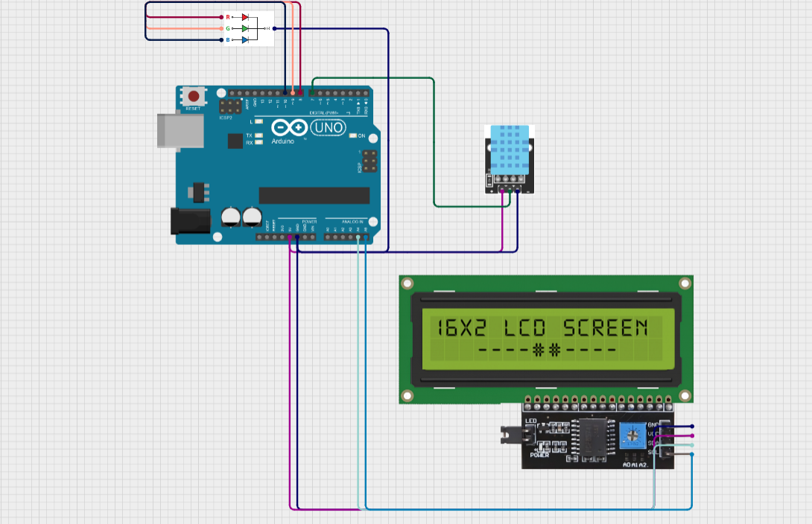

)

# TemperatureHumiditySensor
Simple 🌡️💧temperature and humidity sensor created on Arduino UNO, capable of measuring the current temperature and humidity, as well as reflecting the acceptability of humidity and temperature with a color signal via RGB LED.

# Scheme📋

## Used components🔌:

- Arduino UNO
- LCD1602 I2C
- DHT11
- RGB LED 

| Component    | Pins                              |
| :----------- | :-------------------------------- |
| `LCD1602 I2C`| **GND** -> GND, **VCC** -> 5V, **SDA** -> A4, **SCL** -> A5 |
| `DHT11`      | **S** -> pin7, **VCC** -> 5V, **GND** -> GND |
| `RGB LED`    | **R** -> pin8, **G** -> pin9, **B** -> pin10, **GND** -> GND |

## Used libs📚:

- Wire.h
- LiquidCrystal I2C
- DHT.h

# How it works❓

Data on air temperature and humidity obtained from the DHT11 sensor is read and displayed on the LCD1602 I2C display, and the RGB LED color signal indicates the data norm indicator (normal - green, critical - red, low - blue) simultaneously displaying an indicator symbol in the display on the data lines that indicates which indicator the color signal is displayed.

# Output result✅

It works so good!
